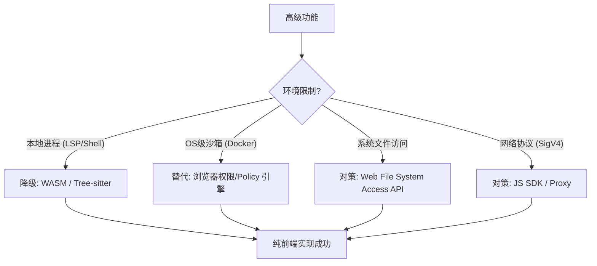

# Browser-Only：缺口能力的降级 / 替代可行性分析

> 面向：本仓库的纯前端（Browser-Only）运行形态（UI v2 + workflow-runtime + `js/agents`）。
>
> 对照入口：`doc-design-ui/FULL_MAPPING.md` 的 Gap 汇总（P0/P1/P2）。

---

## 0) 本仓库当前落地情况（As-Implemented Snapshot）

| 能力 | 可行性（结论） | 本仓库现状 | 主要落点 |
| :--- | :---: | :--- | :--- |
| Plan Mode & 持久化 | High | ✅ done | `js/agents/runtime/plan/plan-store.js` / `js/ppt/workflow/workflow-runtime.js` / `js/ppt/ui-v2/modals/modal-manager.js` |
| Policy / Approvals（PBAC-lite） | High | ✅ done | `js/agents/runtime/policy/engine.js` / `js/agents/runtime/policy/manager.js` / `js/ppt/ui-v2/modals/modal-manager.js` |
| Slash Commands / Command Palette | High | ✅ done | `js/ppt/ui-v2/views/modern-research-view.js` |
| Side-by-side Diff（与 unified 切换） | High | ✅ done | `js/ppt/ui-v2/modals/modal-manager.js`（Artifacts Browser diff viewer） |
| RateLimit（Browser-only 队列/令牌桶） | High | ✅ done | `js/agents/llm/rate-limit.js` / `js/ppt/workflow/workflow-runtime.js` |
| Git（结构化 diff/log/commit） | Medium | ⚠️ n-a/partial（未接入；以 VFS checkpoints 近似） | `js/agents/vfs/checkpoints.js` / `js/agents/vfs/diff.js` |
| LSP | Low–Medium | ⚠️ partial（Tree-sitter 符号索引覆盖一部分） | `js/agents/stages/codesearch/indexing/symbol-indexer.js` |
| /undo（撤销副作用） | High | ✅ done（Browser-only：VFS checkpoint） | `js/agents/runtime/side-effects/side-effect-journal.js` / `js/ppt/ui-v2/views/modern-research-view.js` |

## 1) 总览：限制 → 降级/替代路径

---

## 2) 缺口清单：Browser-Only 可行性结论（按优先级）

### 2.1 核心工作流：Plan Mode & 计划持久化

- 可行性：`High (≈100%)`
- Browser-Only 依赖：IndexedDB / OPFS（或直接复用 RunStore artifacts）
- 推荐落点（与现有架构对齐的版本）：
  - 不建议把“计划生成/对比”硬塞进 `AgentOrchestrator`（它是 Stage runner）；更贴合的做法是：
    - 新增 `plan.*` 事件契约（记录 plan 生成、选定、执行进度）
    - Plan JSON 作为 artifact 持久化（RunStore/OPFS/IDB 任一），UI v2 提供 Plans Manager（列表/恢复/对比）
  - 最小实现（MVP）：
    - plan 只是 `{id, title, steps[], createdAt, updatedAt}` + 选择/执行标记
    - “断点续传”以 `runId` + `planId` + `stepIndex` 为锚点

### 2.2 开发工具链：Git 与代码洞察

#### Git（结构化 diff/log/commit）

- 可行性：`Medium (≈60–80%)`
- 主要难点：
  - 浏览器默认拿不到本地 `.git`；必须依赖用户显式授权（File System Access）或把 repo 放入 OPFS（从而可以读 `.git`）
  - 远端 clone/fetch 受 CORS/鉴权影响（Git HTTP 端点并非都 CORS 友好）
- 可选路线：
  - 路线 A：`isomorphic-git`（Browser 端 JS Git）
    - FS：可选 `lightning-fs`（IndexedDB）或自定义 adapter（桥到 OPFS/FS Access）
    - 风险：bundle 体积、CORS、性能（大 repo）
  - 路线 B：弱化 Git，强化“VFS checkpoints + diff + run replay”
    - 本仓库已有 checkpoint/diff/restore 闭环，更适合 Browser-only 的安全模型

#### LSP（语言服务）

- 可行性：`Low–Medium (≈30–60%)`（取决于语言范围）
- 纯前端替代：
  - Tree-sitter（WASM）继续深化：定义/引用/符号 + 局部语义（覆盖大量静态分析场景）
  - TS/JS：可考虑 Web Worker 内运行 TypeScript Language Service（monaco/tsserver 体系），但会显著增加体积与复杂度

### 2.3 运行时架构：高级控制

#### 令牌桶限流（RateLimit）

- 可行性：`High (≈100%)`
- 纯前端做法：
  - 在 `aiApiService`/modelRouter 层增加 RequestQueue（token bucket / leaky bucket）
  - 与现有 Budget 控制配合（预算是“量”，限流是“速率”）

#### Policy 增强（PBAC）

- 可行性：`High (≈100%)`
- 纯前端做法：
  - 扩展 `js/agents/runtime/policy/engine.js` 的 rule 表达：`and/or/not`、timeRange、domain suffix、更多 resource matchers
  - UI 增加规则管理（查看/编辑/导入导出/测试规则），并把变更写入 PolicyRuleStore（localStorage/IDB）

#### Slash Commands

- 可行性：`High (≈100%)`
- 纯前端做法：
  - UI v2 加一个 Command Palette：输入框检测 `/`，弹出命令列表
  - 命令执行落到现有的 `ui.action` 事件（例如 openApprovals/openArtifacts/openSkills/export/import/replay 等）

### 2.4 交互与展示

#### Side-by-side Diff

- 可行性：`High (≈100%)`
- 纯前端做法：
  - 复用已有 `vfs_checkpoint.json`（unified diff + before/after）
  - UI 渲染层新增“双栏”视图（可用轻量 diff lib；或直接基于 before/after 行级对齐）

#### 旧内容清理（persisted-output 引用治理）

- 可行性：`High (≈100%)`
- 纯前端做法：
  - 在 Agent Loop 的 message 管理中加入“引用清理策略”：仅保留最近 N 个 persisted-output 引用/预览，其余替换为短摘要
  - 与 Cicada 压缩协同：避免“双重压缩”导致信息漂移

---

## 3) 推荐推进顺序（Browser-Only 优先）

1. Plan Mode + 持久化（直接提升可控性、可恢复性、可协作）
2. Policy Engine 增强 + 规则管理 UI（把“能力边界”产品化）
3. Side-by-side Diff（提升“写入前/后可视化”体验）
4. RateLimit（提升稳定性，减少 429/timeout）
5. Git（可选；先做“弱 Git”或只做 diff/log）
6. LSP（按语言逐步做；优先 TS/JS，其他语言走 Tree-sitter）
