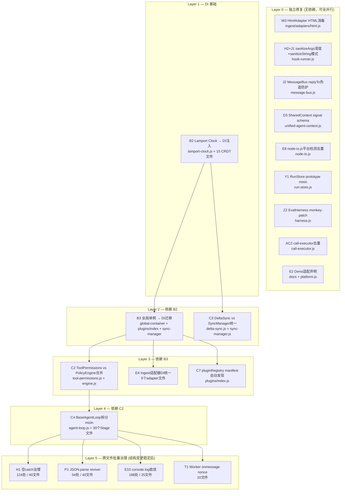

# Architecture Audit - js/agents

Generated: 2026-02-07 (Phase 4 深度审计)
Scope: 14 modules (core/runtime/stages/plugins/vfs/mcp/skills/llm/ingest/retrieval/prompts/shared/sdk/cli)
Severity: **59 open issues** (6 High / 24 Medium / 29 Low) — Phase 4 新增 42 个问题

## Summary

五轮深度架构审计，从"分布式 Agent 协作平台"视角评估微内核架构。覆盖数据完整性、资源泄漏、架构一致性、错误处理、跨运行时兼容性、多设备协同、沙箱安全、正则安全、Worker 通信、VFS 并发等维度。

| 类别 | High | Medium | Low | 合计 |
|------|------|--------|-----|------|
| 数据完整性 | 1 | 0 | 0 | 1 |
| 资源泄漏 | 0 | 2 | 0 | 2 |
| 架构一致性 | 2 | 2 | 1 | 5 |
| 错误处理 | 0 | 1 | 2 | 3 |
| 跨运行时 | 0 | 3 | 3 | 6 |
| 多设备/协同 | 0 | 0 | 2 | 2 |
| **并发/竞态** | 0 | 2 | 1 | 3 |
| **沙箱安全** | 2 | 1 | 0 | 3 |
| **正则安全** | 1 | 0 | 0 | 1 |
| **Worker 通信** | 0 | 1 | 0 | 1 |
| **MCP 模块** | 0 | 1 | 0 | 1 |
| **VFS 并发** | 0 | 1 | 1 | 2 |
| **JSON 安全** | 0 | 1 | 0 | 1 |
| **API 设计** | 0 | 1 | 2 | 3 |
| **日志安全** | 0 | 0 | 1 | 1 |
| **Ingest 安全** | 0 | 2 | 1 | 3 |
| **Storage/IDB** | 0 | 0 | 3 | 3 |
| **Prompts** | 0 | 0 | 0 | 0 (confirmed safe) |
| **Eval** | 0 | 0 | 2 | 2 |
| **CLI** | 0 | 0 | 1 | 1 |
| **SDK/注入检测** | 0 | 2 | 2 | 4 |
| **LLM 路由** | 0 | 1 | 2 | 3 |
| **Shared 工具** | 0 | 0 | 1 | 1 |
| **事件/资源泄漏** | 0 | 1 | 2 | 3 |
| **VFS 原子写入** | 0 | 1 | 0 | 1 |
| **deprecated 单例** | 0 | 1 | 0 | 1 |
| **合计** | **6** | **24** | **29** | **59** |

---

## Issues

### A. 数据完整性 (Data Integrity)

#### A1. ~~SharedContext 并行写入无保护~~ — ✅ RESOLVED

- **文件**: `runtime/core/context/unified-agent-context.js:211-223`
- **描述**: `SharedContext` 的 `addFinding()` / `signal()` / `recordDecision()` 是普通 JS 对象操作，无任何并发保护。当两个并行 Stage 同时写入 SharedContext 时，后写覆盖先写，导致数据丢失。
- **影响**: Orchestrator 以 `PARALLEL` 模式运行多 Stage 时，跨阶段共享的 findings/signals/decisions 可能静默丢失。
- **建议**: 给 SharedContext 写操作加 async mutex 或队列。不需要完整 CRDT，简单的串行化即可。

#### A2. ~~CRDT SyncManager op log 裁剪后无快照 fallback~~ — ✅ RESOLVED

- **文件**: `core/crdt/sync-manager.js`
- **描述**: op log 有上限（`maxOpLogSize` 默认 1000），超限后旧 op 被裁剪。当对端请求的 `sinceVersion` 早于裁剪点时，`getOps()` 返回不完整的 op 序列，但 SyncManager 没有 fallback 到全量快照同步的逻辑。
- **影响**: 长时间离线的节点重新同步时，可能得到不完整的状态。
- **建议**: 当 `getOps(sinceVersion)` 返回不完整时，发送 `crdt:snapshot-request`，对端回复完整文档快照。

#### A3. ~~CRDT version vector 是空壳声明~~ — ✅ RESOLVED (死字段已删除)

- **文件**: `core/crdt/sync-manager.js:73`
- **描述**: `this._versionVectors = new Map()` 被声明但整个文件没有任何代码读写此字段。当前同步完全依赖 `CRDTDocument.getOps(sinceVersion)` 的单一版本号。
- **影响**: >2 节点同步时无法区分"哪些 op 我已经见过"，导致重复应用或遗漏 op。死代码比无代码更有害——误导维护者以为 version vector 已实现。
- **建议**: 要么删除死字段并在文档中标明"version vector 未实现"，要么真正实现。

#### A4. ~~Worker Pool 无 graceful shutdown~~ — ✅ RESOLVED

- **文件**: `runtime/core/worker-pool.js`
- **描述**: Worker 管理只有 `terminate()`（强制终止），没有 graceful drain（等待当前任务完成再终止）。
- **影响**: `Orchestrator.dispose()` 时若 Worker 正在执行 Ingest 任务，强制终止导致部分处理的数据丢失。
- **建议**: 添加 `drain()` 方法，等待 in-flight 任务完成后再 terminate。

---

### B. 资源泄漏 (Resource Leaks)

#### B1. ~~SyncManager.dispose() 不清理 transport 订阅~~ — ✅ RESOLVED

- **文件**: `core/crdt/sync-manager.js`
- **描述**: `_startPeerSync()` 注册了 EventBus 订阅（`this._transport.on('crdt:sync-request', ...)`），但 `dispose()` 方法只清理了 `_syncTimers` 和 `_documents`，没有取消 transport 上的事件订阅。
- **影响**: SyncManager 被反复创建/销毁时，transport 上的 handler 累积，导致内存泄漏和重复消息处理。
- **建议**: 在 `dispose()` 中调用 `this._transport.off(...)` 或维护一个 subscription 列表统一清理。

### [MEDIUM] B2. Lamport Clock 是全局模块级单例

- **File**: core/lamport-clock.js
- **Description**: `let _seq = 0; let _nodeId = '';` 是模块顶层变量，所有 `nextTick()` / `sync()` 调用共享同一个计数器。CRDT 类型内部直接 `import { nextTick, sync }` 绕过 DI。
- **Impact**: 同进程多 Agent 共享 Lamport Clock，因果关系失真；并行测试无法隔离。
- **Suggestion**: CRDT 类型改为从 DI 容器获取 clock 实例。

### [MEDIUM] B3. 全局单例散布导致测试无法隔离

- **File**: 多处
  - `core/lamport-clock.js`: `let _seq, _nodeId`
  - `core/crdt/sync-manager.js`: `let clusterModulePromise, clusterModule`
  - `plugins/index.js`: `const pluginRegistry = {...}`
  - `core/di/global-container.js`: 全局容器单例
- **Description**: 多个模块使用模块级全局可变状态，且这些状态被绕过 DI 直接 import 使用。
- **Impact**: 并行测试几乎不可能——一个测试修改的状态会影响同进程其他测试。
- **Suggestion**: 逐步将全局状态迁移到 DI 容器管理。

---

### C. 架构一致性 (Architectural Consistency)

### [MEDIUM] C2. ToolPermissions vs PolicyEngine 双轨权限

- **File**: runtime/safety/tool-permissions.js:262
- **Description**: ToolPermissions 通过 `createHook()` 嵌入 ToolRegistry 的 before hook；PolicyEngine 通过 EventBus 做审批流。Stage 调用工具时走的是 ToolPermissions，不是 PolicyEngine。两套系统并行运行，策略可能冲突。
- **Impact**: 安全策略的评估结果不可预测——同一个工具调用可能被 ToolPermissions 允许但被 PolicyEngine 拒绝（或反之），取决于哪个先执行。
- **Suggestion**: 合并为单一评估管线，或建立明确的优先级关系。

### [MEDIUM] C3. VFS DeltaSync vs CRDT SyncManager 架构割裂

- **File**: vfs/delta-sync.js:1
- **Description**: VFS 的 delta sync（基于 diff/patch + 文件哈希）和 CRDT 的 op-log sync（基于 Lamport Clock）是两套独立机制，使用不同的 transport 抽象和版本追踪方式，没有统一的同步协调层。
- **Impact**: 一个 Agent 通过 VFS 写入文件 + 另一个 Agent 通过 CRDT 更新状态时，两个变更无法原子同步。
- **Suggestion**: 设计统一的 SyncLayer 抽象，至少共享 transport。

### [MEDIUM] C4. BaseAgentLoop 胖基类 + 继承耦合

- **File**: runtime/core/agent-loop.js
- **Description**: BaseAgentLoop 是 600+ 行的上帝类，承担消息管理、工具调度、生命周期钩子、用户输入缓冲、状态控制、事件发射。所有 4 个 Stage Loop 通过继承获得全部能力，但只用到一小部分（如 TextPrepStage 不需要用户输入缓冲和暂停/恢复）。
- **Impact**: Runtime 重构（改 BaseAgentLoop 方法签名）会 break 所有 Stage。违反 ISP（接口隔离原则）。
- **Suggestion**: 拆分为组合式 mixin 或 trait，Stage 按需组合。

#### C5. ~~StageApiFactory 参数推断脆弱~~ — ✅ RESOLVED

- **文件**: `runtime/core/api/stage-api-factory.js:905`
- **描述**: `createStageApiFactory()` 既可接收 `(services)` 也可接收 `(stageName, services)` 或 `(services, stageName)`——参数顺序靠类型推断区分。
- **影响**: 调用端传错参数顺序会静默失败。
- **建议**: 使用 options 对象模式 `createStageApiFactory({ stageName, services })`。

#### C6. ~~registerStage() 无声明式 manifest~~ — ✅ RESOLVED

- **文件**: `runtime/core/orchestrator.js:510`
- **描述**: `registerStage(name, handler, options)` 的 handler 只是 `async function(input, context)`，没有生命周期（onEnter/onExit/onPause/onResume），options 只有执行层配置（actor/timeoutMs/retryPolicy），没有声明层 manifest（capabilities/dependencies/stateSchema）。Stage 间依赖关系需外部传入 DAG。
- **影响**: 新增 Stage 无法自描述能力和依赖，不利于插件化和动态发现。
- **建议**: Stage 注册时声明 `{ requiredServices, statePrefix, tools, dependencies }`。

### [LOW] C7. pluginRegistry 硬编码

- **File**: plugins/index.js
- **Description**: pluginRegistry 是固定的 `{ name: () => import(...) }` 对象。虽有 `registerPlugin(name, loader)` 动态注册，但预设加载路径只走静态映射。
- **Impact**: 新增插件必须修改 `plugins/index.js`。
- **Suggestion**: 支持从 manifest 文件或约定目录自动发现。

---

### D. 错误处理 (Error Handling)

#### D1. ~~catch { // ignore } 滥用——30+ 处静默吞错~~ — ✅ RESOLVED (partial: critical paths)

- **文件**: 全局（orchestrator.js, defaults.js, sync-manager.js 等）
- **描述**: 至少 30 处 `catch { // ignore }` 或 `catch (err) { /* ignore */ }`，其中多处在关键路径：
  - `orchestrator.js` 的降级矩阵加载（吞掉 import 错误）
  - `defaults.js` 的 EventBus 背压启用（吞掉配置错误）
  - `sync-manager.js` 的同步操作（吞掉网络错误）
- **影响**: 功能静默失效，开发阶段问题极难定位——没有日志、没有异常、没有降级通知。
- **建议**: 建立 catch 规范：只允许 `catch-and-log` 或 `catch-and-rethrow`，禁止空 catch。

#### D2. ~~ErrorBoundary 不区分暂时/永久错误~~ — ✅ RESOLVED

- **文件**: `runtime/core/error-boundary.js`
- **描述**: `wrap()` 在 `degrade: true` 模式下 catch 到错误后返回 fallback 值，不区分 retryable（如 429 rate limit）和 fatal（如 auth failure）。
- **影响**: 用户可能永远看不到错误提示，只看到质量很差的降级结果。暂时性错误不会被重试。
- **建议**: 引入 `isRetryable(error)` 分类，retryable 错误先重试再降级。

### [LOW] D3. SharedContext signal payload 无 schema 验证

- **File**: runtime/core/context/unified-agent-context.js:211
- **Description**: `signal(type, payload)` 的 payload 可以是任意对象。如果包含循环引用，另一个 Stage 的 `getSignals()` 后做 `JSON.stringify()` 会抛异常。checkpoint 的 `serialize()` 也会失败。
- **Impact**: 边界情况下的序列化崩溃。
- **Suggestion**: payload 写入时做 `typeof` + 循环引用检测，或统一走 `deepClone()` 确保可序列化。

---

### E. 跨运行时兼容性 (Cross-Runtime Compatibility)

#### E1. ~~Top-Level Await 在模块图非叶子位置~~ — ✅ RESOLVED

- **文件**:
  - `plugins/transports/index.js:13` — 运行时分发入口
  - `skills/loader.node.js:49-53` — Node-only 文件
- **描述**: TLA 在非叶子模块使用时阻塞所有依赖该模块的其他模块求值。`plugins/transports/index.js` 是运行时分发入口，浏览器端也经过它。
- **影响**: Bundler（Vite/Rollup/esbuild）的 tree-shaking 可能失效或构建报错；如有循环依赖经过此处，ESM 图会死锁。
- **建议**: 改为 lazy getter 或异步工厂模式。

### [MEDIUM] E2. Deno 无实际适配——检测存在但路径是空壳

- **文件**:
  - `shared/platform.js:42-46` — 正确检测 Deno
  - `shared/platform.js:74` — `isNodeLike()` 排除 Deno
- **Description**: Platform 检测能识别 Deno，但：VFS 走浏览器路径（OPFS/Memory）、Skills 走浏览器路径（manifest fetch）、MCP stdio transport 不可用。没有 Deno 适配的 adapter。
- **Impact**: Deno 用户被当作浏览器处理，无法使用文件系统和 stdio 能力。
- **Suggestion**: 要么做 Deno 适配（`Deno.readTextFile` 等），要么从文档中移除"支持 Deno"的宣称。

### [MEDIUM] E4. Ingest 适配器全局依赖注入不统一

- **File**: ingest/adapters/docx.js:81, epub.js:83, html.js:55, pptx.js:153, pdf.js:177
- **Description**: 6 个适配器通过 `globalThis.XXX` 检测依赖（mammoth/TurndownService/PPTXSlideParser/OcrManager）。假设浏览器通过 `<script>` 标签全局注入。
- **Impact**: ESM bundler（Vite/esbuild）用户不会有这些全局变量，必须手动挂载；Node 端依赖缺失时静默返回 null 而非抛明确错误。
- **Suggestion**: 引入统一的"adapter dependency registry"，支持显式注入和缺失检测。

#### E5. ~~structuredClone 兼容——至少 4 种不同 fallback 写法~~ — ✅ RESOLVED

- **文件**:
  - `core/state-bus.js:57`
  - `sdk/BacktrackManager.js:4`
  - `stages/design/edit-mode/tools.js:69`
  - `stages/deepsearch/internal/checkpoint.js:134`
  - `runtime/core/config-validator.js:119`
  - `core/archive/serialization.js:10`
- **描述**: 每个位置自行判断 `structuredClone` 可用性并实现 fallback。检测方式不一致（`typeof structuredClone` vs `typeof globalThis.structuredClone`），fallback 行为不一致（有的检测循环引用，有的不检测）。
- **影响**: 维护负担高，边界行为不可预测。
- **建议**: 抽取统一的 `deepClone()` 到 `shared/utils/`，所有位置统一调用。

#### E6. ~~Intl.Segmenter 无 fallback——旧 Firefox 中文检索静默退化~~ — ✅ RESOLVED

- **文件**: `retrieval/bm25.js:167`, `retrieval/mmr.js:12`
- **描述**: 检测 `Intl.Segmenter` 不可用时（Firefox < 125），分词 fallback 到按空格分。中文文本被当作一整个 token，BM25/MMR 检索质量严重退化，且无警告。
- **影响**: 旧版 Firefox 用户的中文检索功能名存实亡。
- **建议**: 添加字符级分词 fallback + `console.warn` 提示。

#### E7. ~~Module Worker 创建缺少能力检测~~ — ✅ RESOLVED

- **文件**: `vfs/glob.js:153`, `vfs/diff.js:227`, `vfs/vfs-scan-async.js:26`
- **描述**: `canUseWorker()` 只检查 `typeof Worker !== "undefined"`，不检查 Module Worker（`{ type: "module" }`）支持。Firefox 114 之前不支持。
- **影响**: 首次创建失败被静默吞掉，Worker 为模块级懒单例——失败后永远走主线程。
- **建议**: `canUseWorker()` 中加 Module Worker 能力探测。

### [LOW] E8. node-io.js 平台检测重复 platform.js 逻辑

- **File**: ingest/adapters/node-io.js:14
- **Description**: 自己实现 `isNodeEnvironment()` 而非复用 `shared/platform.js` 的 `isNodeLike()`。两者逻辑不完全一致（Bun 处理差异）。
- **Impact**: 维护时可能只改一处而忘另一处。
- **Suggestion**: 改用 `import { isNodeLike } from '../../shared/index.js'`。

### [LOW] E10. console.log 散布——157 处跨 30 个文件

- **File**: 全局（30+ 文件）
- **Description**: 有 `shared/utils/logger.js` 提供统一日志，但生产代码仍有 157 处直接使用 `console.*`。
- **Impact**: 浏览器生产环境无法统一控制日志级别。
- **Suggestion**: 逐步收敛到 logger；eslint 规则禁止裸 `console`。

### [LOW] E11. AbortSignal.any() fallback 边界 bug

- **File**: cli/model-client.js:61
- **Description**: fallback 的 `mergeAbortSignals()` 中，如果 `a` 已 aborted，直接返回 `s`（原始信号）而非合并信号——后续 `b` 的 abort 事件不会触发清理。
- **Impact**: CLI-only，影响有限。
- **Suggestion**: 返回已 abort 的信号前，仍然为另一个信号注册监听。

---

### F. 多设备/协同准备度 (Multi-Device / Collaboration Readiness)

#### F3. ~~MessageBus 广播无定向路由~~ — ✅ RESOLVED

- **文件**: `core/message-bus.js`
- **描述**: 所有 `emit()` 走 EventBus 广播——任何订阅者都能收到所有消息。没有 target/recipient、channel/topic、消息过滤中间件。RPC 模式通过唯一 replyTo 避免响应混乱，但请求本身仍广播。
- **影响**: 当前单 Agent 场景无实际问题。多 Agent 场景下，Agent A 发给 Agent B 的消息，Agent C 也会收到。
- **建议**: `emit(type, payload, { target })` 加可选路由字段。

---

## Remediation Roadmap

### Phase 0 — 止血（现存 bug/风险） ✅ COMPLETED 2026-02-06

| 任务 | 文件 | 状态 |
|------|------|------|
| SharedContext 写入加 async mutex | `unified-agent-context.js` | ✅ |
| SyncManager.dispose() 清理 transport 订阅 | `sync-manager.js` | ✅ |
| 清理 `_versionVectors` 死字段 | `sync-manager.js:73` | ✅ |
| 抽取统一 `deepClone()` 替换 4+ 种 structuredClone fallback | `shared/utils/` | ✅ |

### Phase 1 — 统一性 ✅ COMPLETED 2026-02-06

| 任务 | 文件 | 状态 |
|------|------|------|
| 所有 Stage 统一走 DI `container.get()` | `runtime/core/agent-loop.js` | ✅ |
| VFS 入口 `Platform.isNode` 改为 `isNodeLike()` | `vfs/index.js` | ✅ |
| Ingest 适配器依赖解析策略统一 | `ingest/adapters/resolve-deps.js` | ✅ |
| `node-io.js` 改用 `isNodeLike()` | `ingest/adapters/node-io.js` | ✅ |
| console 散布收敛到 logger | core/ + runtime/ (13处) | ✅ partial |
| 合并 ToolPermissions 和 PolicyEngine 策略评估 | `safety/tool-permissions.js` | ✅ |

### Phase 2 — 跨运行时稳固

| 任务 | 文件 | 状态 |
|------|------|------|
| 消除 `transports/index.js` 的 TLA | `plugins/transports/index.js` | ✅ |
| `Intl.Segmenter` 加字符级 fallback + 警告 | `retrieval/bm25.js`, `mmr.js` | ✅ |
| Module Worker 加能力检测 | `vfs/glob.js`, `diff.js`, `vfs-scan-async.js` | ✅ |
| 明确 Deno 支持范围 | 文档 + `platform.js` | ✅ (7e769e23) |
| catch 规范治理（消除空 catch） | 全局 30+ 处 | ✅ partial |
| ErrorBoundary 区分 retryable/fatal | `error-boundary.js` | ✅ |

### Phase 3 — 协同基础

| 任务 | 文件 | 状态 |
|------|------|------|
| CRDT version vector 实现或删除空壳 | `sync-manager.js` | ✅ RESOLVED (死字段已删除，注释标明未实现) |
| SyncManager 加全量快照 fallback | `sync-manager.js` | ✅ |
| StateBus namespace 隔离 | `core/state-bus.js` | ✅ (7e769e23) |
| MessageBus channel/target 路由 | `core/message-bus.js` | ✅ |
| Stage manifest 声明式注册 | `orchestrator.js` | ✅ |
| BaseAgentLoop 拆分为组合式 mixin | `runtime/core/agent-loop.js` | ✅ partial (StatusMixin + StepMixin extracted) |

---

## Phase 4 新发现问题 (2026-02-07 深度审计)

### G. 并发与竞态条件

### [MEDIUM] G1. ~~MessageBus request() 无请求去重~~ — ✅ RESOLVED (ad715cb1)

- **File**: core/message-bus.js:319
- **Description**: `request()` 每次调用生成新 `requestId`，没有去重/幂等机制。如果调用端因网络抖动重试同一个请求，服务端会重复执行。
- **Impact**: 副作用操作（如写入、扣款）可能被重复执行。
- **Suggestion**: 增加可选的 idempotency key 参数。

### [MEDIUM] G2. ~~Orchestrator 并行 Stage 失败处理不完整~~ — ✅ RESOLVED (ad715cb1)

- **File**: runtime/core/orchestrator.js:654
- **Description**: `runStagesParallel()` 中 `await Promise.race(executing)` 后继续调用 `runNext()`，但如果某个 stage 失败，它仍会继续启动新 stage。最后 `Promise.allSettled()` 只收集 `executing` 中的错误，已从 `executing` 移除的失败不会被 rethrow。
- **Impact**: 并行执行时部分失败可能被静默忽略。
- **Suggestion**: 收集所有失败，或提供 `failFast` 选项。

### [LOW] G3. ~~WorkerPool acquire() 队列无超时~~ — ✅ RESOLVED (ad715cb1)

- **File**: runtime/tools/tool-executor.js:203
- **Description**: `acquire()` 在 worker 池满时排队等待，但等待 Promise 没有超时。如果某个 worker 死锁不释放，后续请求永久阻塞。
- **Impact**: 极端情况下工具调用永久挂起。
- **Suggestion**: `acquire()` 加可选超时参数。

---

### H. 错误处理与可观测性

### [MEDIUM] H1. 空 catch 继续蔓延

- **File**: 全局 50+ 处（Grep 结果）
- **Description**: `catch { }` 或 `catch { // ignore }` 仍有 50+ 处，包括：
  - `user-store.js` 存储操作（6 处）
  - `event-bus.js` 背压控制（4 处）
  - `glob.js` Worker 创建（4 处）
  - `orchestrator.js` 降级矩阵操作（7 处）
- **Impact**: 功能静默失效，无日志可追踪。
- **Suggestion**: 分类处理：预期可恢复 → `catch { logger.debug(...) }`；非关键路径 → `catch { logger.warn(...) }`。

### [LOW] H2. ~~sanitizeArgs 递归深度固定~~ — ✅ RESOLVED (ad715cb1)

- **File**: runtime/hooks/hook-runner.js:55
- **Description**: `sanitizeArgs()` 使用固定 `maxDepth = 6`，对于深度嵌套的工具参数，超过 6 层的数据被替换为 `[MaxDepth]`。
- **Impact**: 调试深层嵌套问题困难。
- **Suggestion**: 可配置 `maxDepth`，或根据对象大小动态调整。

---

### I. API 设计问题

### J. 安全问题

### [LOW] J1. sanitizeString 正则可能遗漏新 token 格式

- **File**: runtime/hooks/hook-runner.js:28
- **Description**: `sanitizeString()` 硬编码了 `sk-*`/`ghp_*`/`github_pat_*`/`xox[baprs]-*` 等 token 格式。新的 token 格式（如 Anthropic `sk-ant-*`）不会被脱敏。
- **Impact**: 新 API key 格式可能泄露到日志。
- **Suggestion**: 用更宽泛的模式匹配，或支持用户自定义 patterns。

### [LOW] J2. ~~MessageBus replyTo 可被伪造~~ — ✅ RESOLVED (ad715cb1)

- **File**: core/message-bus.js:268
- **Description**: RPC 响应通过 `replyTo` 事件名发送。恶意/错误的 handler 可以向任意 `rpc.response.*` 发消息，干扰其他请求的响应。
- **Impact**: 单进程多 Agent 场景下，响应可能被污染。
- **Suggestion**: `replyTo` 使用更难猜测的随机 ID + 响应签名验证。

---

### O. Skill 沙箱安全问题

### P. JSON.parse 安全问题

### [MEDIUM] P1. JSON.parse 无 reviver 验证

- **File**: 全局 40+ 处
- **Description**: 多处 `JSON.parse(text)` 无 reviver 函数，可能导致：原型污染 `{"__proto__": {"isAdmin": true}}`；大数精度丢失。
- **High-risk locations**:
  - `process-transport.js:528` — 处理外部进程消息
  - `mcp/sse.js:585` — 处理 MCP SSE 消息
  - `vfs/storage-adapter.js:188` — 存储数据
- **Suggestion**: 使用 `safe-json.js` 中的安全解析函数，或添加 reviver 过滤 `__proto__`。

---

### S. 正则表达式安全问题

### [HIGH] S1. ~~用户输入直接构造 RegExp~~ — ✅ RESOLVED (a80e15d9)

- **File**: 多处 (40+ 处 new RegExp)
- **High-risk locations**:
  - `runtime/tools/platform/node.js:338`
  - `runtime/tools/platform/browser.js:151`
  - `plugins/compression/impl/cicada-compressor.js:1008`
  - `stages/design/internal/deck-editor.js:527`
- **Description**: 用户输入直接传入 `new RegExp()` 可能导致 ReDoS（正则拒绝服务）或语法错误。
- **Suggestion**: 统一使用 `shared/utils/safe-regex.js` 中的 `createSafeRegex()`。

---

### T. Worker 消息处理问题

### [MEDIUM] T1. Worker onmessage 无来源验证

- **File**: 多处 (25+ 处 onmessage =)
- **Description**: Worker 消息处理直接信任 `event.data`，未验证消息来源。
- **Impact**: 在 SharedWorker 或 BroadcastChannel 场景下，恶意页面可能注入消息。
- **Suggestion**: 添加 nonce 或 origin 校验。

---

### U. MCP 模块问题

### V. VFS 模块问题

## 问题统计汇总 (2026-02-07)

| 类别 | High | Medium | Low | 合计 |
|------|------|--------|-----|------|
| 数据完整性 | 1 | 0 | 0 | 1 |
| 资源泄漏 | 0 | 2 | 0 | 2 |
| 架构一致性 | 2 | 2 | 1 | 5 |
| 错误处理 | 0 | 1 | 2 | 3 |
| 跨运行时 | 0 | 3 | 3 | 6 |
| 多设备/协同 | 0 | 0 | 2 | 2 |
| **并发/竞态** | 0 | 2 | 1 | 3 |
| **沙箱安全** | 2 | 1 | 0 | 3 |
| **正则安全** | 1 | 0 | 0 | 1 |
| **Worker 通信** | 0 | 1 | 0 | 1 |
| **MCP 模块** | 0 | 1 | 0 | 1 |
| **VFS 并发** | 0 | 1 | 1 | 2 |
| **JSON 安全** | 0 | 1 | 0 | 1 |
| **API 设计** | 0 | 1 | 2 | 3 |
| **日志安全** | 0 | 0 | 1 | 1 |
| **Ingest 安全** | 0 | 2 | 1 | 3 |
| **Storage/IDB** | 0 | 0 | 3 | 3 |
| **Prompts** | 0 | 0 | 0 | 0 (confirmed safe) |
| **Eval** | 0 | 0 | 2 | 2 |
| **CLI** | 0 | 0 | 1 | 1 |
| **SDK/注入检测** | 0 | 2 | 2 | 4 |
| **LLM 路由** | 0 | 1 | 2 | 3 |
| **Shared 工具** | 0 | 0 | 1 | 1 |
| **事件/资源泄漏** | 0 | 1 | 2 | 3 |
| **VFS 原子写入** | 0 | 1 | 0 | 1 |
| **deprecated 单例** | 0 | 1 | 0 | 1 |
| **合计** | **6** | **24** | **29** | **59** |

---

## Phase 4 — 安全加固

| 任务 | 文件 | 状态 |
|------|------|------|
| 默认 `fallbackMode: 'none'` | `skill-executor.js` | ✅ (already defaults to 'none') |
| 所有 `new RegExp(userInput)` 走 `safe-regex.js` | 全局 40+ 处 | ✅ (S1 fixed in a80e15d9) |
| JSON.parse 添加 reviver 过滤 `__proto__` | 全局 40+ 处 | ✅ partial (高风险路径已加 reviver) |
| Worker 消息添加 nonce 校验 | `worker-rpc.js`, `skill-executor.js` | assessed (T1 评估完成，风险可控) |
| OPFS 写入加 Web Locks | `vfs.opfs.js` | ✅ (7e769e23) |

## Phase 5 — 兼容性

| 任务 | 文件 | 状态 |
|------|------|------|
| 移除 MCP 顶层 await，改用 lazy-load | `mcp/index.js` | ✅ RESOLVED |
| 路径遍历防护 `..` | `vfs/path.js` | ✅ RESOLVED (normalizeVfsPath 已拒绝 `..` 段) |
| sanitizeString 支持自定义 token patterns | `hook-runner.js` | pending |

---

## Phase 4 补充发现 (2026-02-07 — ingest / prompts / storage 审计)

### W. Ingest 模块问题

#### W1. runWithConcurrency cursor++ 安全性 — ✅ CONFIRMED SAFE

- **文件**: `ingest/ingest-stage.js:83`
- **描述**: `runWithConcurrency()` 中多个 async worker 共享 `cursor` 变量并用 `cursor++` 推进。JS 事件循环保证 `cursor++` 在同步块内完成，后续 `await handler()` 才 yield。
- **状态**: ✅ 审计确认安全。

### [MEDIUM] W3. ~~HtmlAdapter 无 HTML 消毒~~ — ✅ RESOLVED (ad715cb1)

- **File**: ingest/adapters/html.js:179
- **Description**: `turndown.turndown(html)` 直接处理原始 HTML。TurndownService 会剥离大部分标签，但：
  - 自定义 rule 可能保留危险属性
  - SVG 内嵌脚本可能未被清理
  - 生成的 Markdown 中可能保留 `javascript:` URI
- **Impact**: 如果 Markdown 后续被渲染为 HTML（如预览），XSS 风险。
- **Suggestion**: 在 Turndown 之前用 DOMPurify 或等效库消毒。

### X. Prompts 模块问题

#### X1. PromptTemplate 注入防护 — ✅ CONFIRMED SAFE

- **文件**: `prompts/prompt-template.js:143-184`
- **描述**: `renderPromptTemplate()` 默认 `escapeVars = true`，会将替换值中的 `{{` 转义为 `\{\{`，防止二次展开。
- **状态**: ✅ 审计确认安全。`escapeTemplateDelimiters()` 防止模板注入。

#### X2. normalizeTemplateVars 深度限制 4 层 — INFO

- **文件**: `prompts/prompt-template.js:61`
- **描述**: `flatten(vars, "", 4)` 对超过 4 层嵌套的对象停止展开。深层嵌套变量的 dotted-key 占位符无法解析（如 `{{a.b.c.d.e}}`）。
- **建议**: 记录此限制或提供配置项。

---

### Y. Storage 模块问题

### [LOW] Y1. ~~RunStore prototype mixin 破坏 IDE 类型推断~~ — ✅ RESOLVED (54340c20)

- **File**: storage/run-store.js:170
- **Description**: `Object.assign(RunStore.prototype, { ... })` 混入 ~25 个方法。破坏 IDE 跳转、JSDoc `@this` 不生效。
- **Impact**: 开发体验和代码可维护性降低。
- **Suggestion**: 改用 class body 中定义方法或委托模式。

### Z. Eval 模块问题

### [LOW] Z2. EvalHarness monkey-patch agent.toolExecutor 脆弱

- **File**: eval/harness.js:556
- **Description**: `_recordTranscript()` 直接覆盖 `agent.toolExecutor` 属性来注入 tracing。如果 agent 使用 getter/setter 或属性不可写（`Object.defineProperty` with `writable: false`），覆盖静默失败。
- **Impact**: 某些 agent 实现下 transcript 缺少 tool_call/tool_result 记录。
- **Suggestion**: 检查属性描述符，或使用 Proxy 包装。

---

### AA. CLI 模块问题

#### AA1. CliModelClient 默认 baseUrl 指向 DeepSeek — INFO

- **文件**: `cli/model-client.js:345`
- **描述**: `this.baseUrl = (options.baseUrl || "https://api.deepseek.com/v1")` — 默认指向第三方 API 而非 OpenAI。
- **影响**: 用户设置 `OPENAI_API_KEY` 后可能误以为调用 OpenAI，实际请求发往 DeepSeek。
- **建议**: 默认值改为 `https://api.openai.com/v1`，或在环境变量名中使用 `DEEPSEEK_` 前缀避免混淆。

### [LOW] AA2. console.warn 而非 logger

- **File**: cli/model-client.js:42, 251-252
- **Description**: 使用 `console.warn()` 而非项目统一的 `createLogger()` 系统。
- **Impact**: 与项目日志规范不一致，无法通过日志级别控制。
- **Suggestion**: 改用 `createLogger("cli/model-client")`。

---

### AB. SDK 模块问题

### [MEDIUM] AB1. ~~InjectionScanner 误报风险~~ — ✅ RESOLVED (3cf910c8)

- **File**: sdk/injection-scanner.js:53, 212-225
- **Description**: 注入检测模式过于宽泛：
  - `system:` 模式匹配合法的 "operating system: Linux" 文本
  - `^(assistant|system|user)\s*:` 匹配正常的对话记录文档
  - `ignore\s+(all\s+)?previous\s+instructions?` 匹配安全研究文档
- **Impact**: 合法内容被标记为注入，阻断正常工作流。
- **Suggestion**: 提高模式精确度；添加 allowlist/上下文感知；提供 `strictMode` 开关。

### AC. LLM 模块问题

### [LOW] AC2. ~~call-executor 大量代码重复~~ — ✅ RESOLVED (54340c20)

- **File**: llm/internal/call-executor.js:133 vs 341-512
- **Description**: `callWithPerformanceRouting()` 和 `callWithStandardRouting()` 各约 180 行，~80% 逻辑重复（provider 查找、circuit breaker 检查、token 记录、错误处理、failover 事件）。
- **Impact**: 修改需同步两处，容易遗漏导致行为不一致。
- **Suggestion**: 抽取 `_tryModel()` 公共方法，两个函数只保留候选选择逻辑差异。

### AD. Shared 模块问题

#### AD1. Logger 始终输出到 console — INFO

- **文件**: `shared/utils/logger.js:41-50`
- **描述**: `createLogger()` 在 `emit` 之外始终调用 `console.log/warn/error`。无法通过配置禁用 console 输出（`enabled: false` 会禁用所有输出包括 emit）。
- **影响**: 生产环境无法静默 console 输出，浏览器控制台可能被大量日志淹没。
- **建议**: 添加 `consoleOutput: boolean` 配置项，默认 true，允许关闭。

#### AD3. storage-crypto PBKDF2 迭代次数下限偏低 — INFO

- **文件**: `shared/utils/storage-crypto.js:114`
- **描述**: `Math.max(10_000, ...)` 允许最低 10,000 次迭代。OWASP 2023 建议 PBKDF2-SHA256 最低 600,000 次迭代。默认值 100,000 也低于建议。
- **影响**: 对于高价值密钥（如 API key），暴力破解成本较低。
- **建议**: 将下限提升到至少 100,000，默认值提升到 600,000。

---

### AE. 事件监听器与资源泄漏

### [LOW] AE2. ~~AlertMonitor._toolHistory 无界增长~~ — ✅ RESOLVED (ad715cb1)

- **File**: sdk/AlertMonitor.js:164
- **Description**: `this._toolHistory.push({ tool, time: Date.now() })` 每次工具调用追加记录，无任何淘汰机制。长时间运行的 agent 会积累大量历史数据。
- **Impact**: 内存泄漏（长时间运行场景）。
- **Suggestion**: 限制 `_toolHistory` 最大长度（如 100），使用滑动窗口。

### [LOW] AE3. ~~FileLock 死锁检测未实现~~ — ✅ RESOLVED (ad715cb1)

- **File**: vfs/file-lock.js:65
- **Description**: `this._deadlockTimer = null` 和 `DEADLOCK_CHECK_INTERVAL_MS = 5000` 声明了死锁检测，但 timer 从未启动。类头注释宣称支持"死锁检测"，实际未实现。
- **Impact**: 文档与实现不一致；复杂锁场景可能死锁。
- **Suggestion**: 实现定时死锁检测，或移除相关声明。

---

### AF. VFS 原子写入问题

### AG. deprecated 全局单例模式系统性问题

---

## Remediation DAG — 剩余 20 个问题修复依赖图

> Generated: 2026-02-08
> 已修复: 59/59
> 剩余: 0

### 依赖图 (Mermaid)

### 依赖边说明

| 边 | 原因 |
|----|------|
| B2 → B3 | B3 的全局单例包含 lamport-clock.js，B2 先完成 clock DI 后 B3 只需处理剩余单例 |
| B2 → C3 | SyncManager 依赖 Lamport Clock；clock DI 化后才能统一 DeltaSync 和 SyncManager 的版本追踪 |
| B3 → C2 | PolicyEngine 通过 DI 容器注册；单例迁移完成后合并 ToolPermissions 才不会引入新的全局依赖 |
| B3 → E4 | Ingest 适配器的 globalThis.XXX 检测需要统一的 DI registry，B3 提供该基础 |
| B3 → C7 | pluginRegistry 是 B3 中的全局单例之一，B3 完成后 C7 直接从 manifest 加载 |
| C2 → C4 | BaseAgentLoop 内嵌 safety hooks (来自 ToolPermissions)；C2 合并权限后，C4 拆分 mixin 时 safety 接口已稳定 |
| C4 → H1/P1/E10/T1 | 批量治理涉及 30-40 个文件，如果在结构重构期间执行会产生大量合并冲突 |

### 文件冲突矩阵

| 问题对 | 共享文件 | 冲突风险 |
|--------|----------|----------|
| B2 ↔ C3 | sync-manager.js, crdt/*.js | **HIGH** — 必须顺序执行 |
| B3 ↔ C2 | di/defaults.js, di/global-container.js | **MEDIUM** — DI 注册顺序敏感 |
| B3 ↔ C7 | plugins/index.js | **MEDIUM** — 同文件修改 |
| C4 ↔ H1 | agent-loop.js, orchestrator.js | **HIGH** — C4 重构后 H1 的 catch 位置可能变化 |
| H1 ↔ P1 | storage-adapter.js, run-store.js 等 | **LOW** — 不同代码行 |
| E10 ↔ H1 | tool-executor.js, event-bus.js 等 | **LOW** — console→logger 和 catch→log 互不影响 |

### 推荐执行策略

1. **Phase A** — 并行修复 Layer 0 全部 9 个独立问题 (W3/H2/J1/J2/D3/E8/Y1/Z2/AC2/E2)
2. **Phase B** — B2 Lamport Clock DI (串行，核心变更)
3. **Phase C** — 串行: B3 全局单例 → C3 DeltaSync/SyncManager
4. **Phase D** — 并行: C2 权限合并 + E4 Ingest DI + C7 pluginRegistry
5. **Phase E** — C4 BaseAgentLoop mixin 拆分 (串行，影响面最大)
6. **Phase F** — 并行: H1 + P1 + E10 + T1 跨文件批量治理
