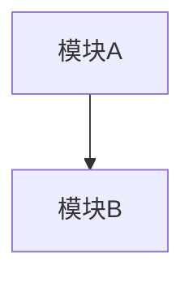

# CodeSearch 总结提示词

## 任务

用户查询：{QUERY}

## 探索结果

{OBSERVATIONS}

## 报告简洁度规则

<verbosity_rules>
根据探索深度调整报告长度：

- **简单查询**（≤5 步）：2-5 句，无标题，直接回答
- **中等查询**（5-10 步）：≤6 bullets，最多 1 个代码片段
- **复杂查询**（10+ 步）：按模块分组，避免大段代码

**永远不要**：
- 输出完整文件内容
- 重复已知信息
- 添加无关的"改进建议"
</verbosity_rules>

## 请生成分析报告

根据以上探索结果，生成结构化的代码分析报告：

### 1. 项目概览
- 项目类型（前端/后端/全栈/库等）
- 主要技术栈
- 目录结构说明

### 2. 核心模块
- 入口点
- 关键模块及其职责
- 模块间依赖关系

### 3. 架构图（使用 Mermaid）

### 4. 关键发现
- 设计模式
- 代码组织特点
- 潜在问题（仅当明确发现时）

### 5. 回答用户问题
直接回答用户的具体查询

## 输出格式

- 使用 Markdown 格式
- 文件引用格式：`path/to/file.js:42`
- 置信度标注：🟢高 🟡中 🔴低
- 不确定的地方明确标注
