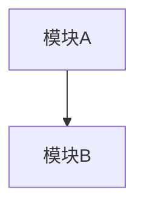

# CodeSearch 总结提示词

## 任务

用户查询：{QUERY}

## 探索结果

{OBSERVATIONS}

## 请生成分析报告

请根据以上探索结果，生成结构化的代码分析报告，包括：

### 1. 项目概览
- 项目类型（前端/后端/全栈/库等）
- 主要技术栈
- 目录结构说明

### 2. 核心模块
- 入口点
- 关键模块及其职责
- 模块间依赖关系

### 3. 架构图（使用 Mermaid）

### 4. 关键发现
- 设计模式
- 代码组织特点
- 潜在改进点

### 5. 回答用户问题
直接回答用户的具体查询

请用 Markdown 格式输出。
